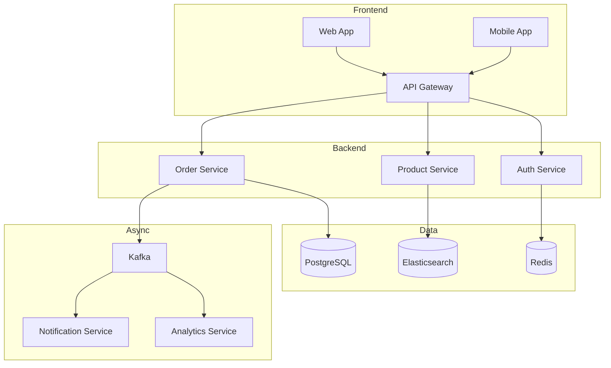
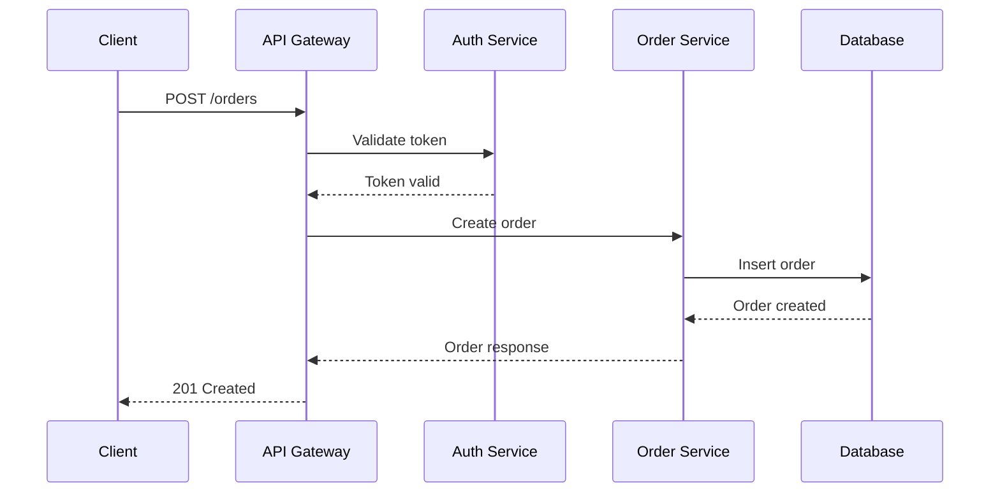
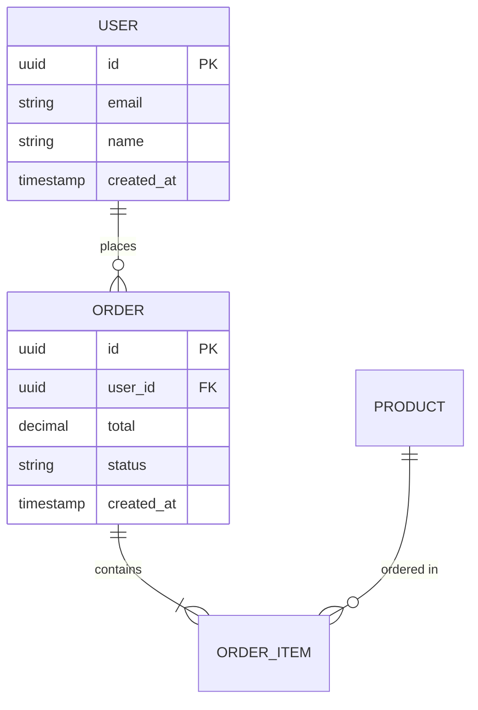

# Technical Documentation - Complete Guide

> **MUST REMEMBER**: Documentation types: ADRs (why decisions were made), README (getting started), Runbooks (operational procedures), API docs (how to integrate). Write for your audience (developers, operators, future-you). Keep docs close to code (in repo). Update docs when code changes. Use diagrams for architecture. Good docs prevent repeated questions and onboarding friction.

---

## How to Explain Like a Senior Developer

"Documentation is communication across time. It answers questions when you're not available - at 3 AM during an incident, when a new hire joins, or when future-you forgets why you made that decision. The key types: ADRs capture *why* we chose X over Y (invaluable 2 years later), READMEs get people started quickly, Runbooks guide operators through incidents, API docs enable integration. Keep docs in the repo so they're versioned with code. The biggest mistake is treating docs as an afterthought - if you don't update docs when code changes, you have worse than no docs (misleading docs). Use diagrams for architecture, but keep them maintainable (Mermaid, not PowerPoint)."

---

## Core Documentation Types

### Architecture Decision Records (ADRs)

```markdown
# ADR-001: Use PostgreSQL for Primary Database

## Status
Accepted

## Date
2024-01-15

## Context
We need to choose a primary database for our e-commerce platform. 
Key requirements:
- ACID transactions for orders and payments
- Complex queries for reporting
- 10M+ products, 1M+ daily orders expected
- Team experience is primarily with SQL databases

Options considered:
1. PostgreSQL
2. MySQL
3. MongoDB
4. CockroachDB

## Decision
We will use PostgreSQL as our primary database.

## Rationale

### Why PostgreSQL over alternatives:

**vs MySQL:**
- Better JSON support for flexible product attributes
- Superior full-text search built-in
- Better handling of concurrent writes with MVCC
- Team preference from past projects

**vs MongoDB:**
- We need strong ACID guarantees for financial transactions
- Complex joins for reporting are easier in SQL
- Schema enforcement prevents data quality issues
- Team has limited NoSQL experience

**vs CockroachDB:**
- CockroachDB is excellent but adds operational complexity
- We don't need global distribution yet
- PostgreSQL can scale to our needs with read replicas
- Cost: CockroachDB cloud is significantly more expensive

### Risks and mitigations:
- **Risk:** Single point of failure
  - **Mitigation:** Primary + synchronous replica for failover
- **Risk:** Scaling limits
  - **Mitigation:** Read replicas for read-heavy workloads; revisit sharding if we exceed 10TB

## Consequences

### Positive:
- Well-understood technology, easy to hire
- Rich ecosystem (extensions, tools)
- Strong community support
- Team can ramp up quickly

### Negative:
- Need to manage replication ourselves (or use managed service)
- May need to revisit for global distribution
- Schema migrations require careful planning

## References
- [PostgreSQL vs MySQL Comparison](https://example.com)
- [Our scaling estimates](./docs/scaling-estimates.md)
- Discussion in #architecture-decisions Slack channel
```

### README Template

```markdown
# Project Name

Brief description of what this project does and why it exists.

## Quick Start

```bash
# Clone the repository
git clone https://github.com/org/project.git
cd project

# Install dependencies
npm install

# Set up environment
cp .env.example .env
# Edit .env with your values

# Start development server
npm run dev
```

Visit http://localhost:3000

## Prerequisites

- Node.js 18+
- PostgreSQL 15+
- Redis 7+

## Architecture

```
┌─────────────┐     ┌─────────────┐     ┌─────────────┐
│   Client    │────▶│   API       │────▶│  Database   │
│  (React)    │     │  (Express)  │     │ (PostgreSQL)│
└─────────────┘     └─────────────┘     └─────────────┘
                           │
                           ▼
                    ┌─────────────┐
                    │   Cache     │
                    │  (Redis)    │
                    └─────────────┘
```

See [Architecture Documentation](./docs/architecture.md) for details.

## Development

### Running Tests

```bash
# Unit tests
npm test

# Integration tests (requires database)
npm run test:integration

# End-to-end tests
npm run test:e2e
```

### Code Style

We use ESLint and Prettier. Run `npm run lint` before committing.

### Making Changes

1. Create a branch from `main`
2. Make your changes
3. Add tests
4. Submit a PR

See [Contributing Guide](./CONTRIBUTING.md) for details.

## Deployment

Deployed automatically via GitHub Actions on merge to `main`.

- **Staging:** https://staging.example.com
- **Production:** https://example.com

See [Deployment Guide](./docs/deployment.md) for manual deployment steps.

## Configuration

| Variable | Description | Default |
|----------|-------------|---------|
| `DATABASE_URL` | PostgreSQL connection string | - |
| `REDIS_URL` | Redis connection string | - |
| `JWT_SECRET` | Secret for JWT tokens | - |
| `LOG_LEVEL` | Logging verbosity | `info` |

## API Documentation

- [API Reference](./docs/api.md)
- [OpenAPI Spec](./openapi.yaml)

## Troubleshooting

### Common Issues

**Database connection refused**
- Ensure PostgreSQL is running
- Check `DATABASE_URL` in `.env`

**Tests failing with timeout**
- Increase Jest timeout: `jest --testTimeout=10000`

## Team

- **Maintainers:** @alice, @bob
- **Slack:** #project-name

## License

MIT - see [LICENSE](./LICENSE)
```

### Runbook Template

```markdown
# Runbook: Service X High Error Rate

## Overview
This runbook covers how to respond when Service X error rate exceeds 5%.

**Severity:** P2  
**On-call escalation:** After 15 minutes if not mitigated

## Detection

This alert triggers when:
- Error rate > 5% for 5 minutes
- Source: Datadog monitor "Service X Error Rate"

## Impact

When this happens:
- Users see "Something went wrong" errors
- Orders may fail to process
- Downstream services may timeout

## Investigation Steps

### 1. Check Recent Deployments

```bash
# View recent deployments
kubectl rollout history deployment/service-x -n production
```

If a deployment happened in last 30 minutes, consider rollback (see Step 5).

### 2. Check Error Logs

```bash
# Tail error logs
kubectl logs -f deployment/service-x -n production | grep ERROR

# Or via Datadog
# Go to Logs > service:service-x status:error
```

Look for patterns:
- Database connection errors → Check DB health
- Timeout errors → Check downstream services
- OutOfMemory → Check memory usage

### 3. Check Dependencies

| Dependency | Health Check | Dashboard |
|------------|--------------|-----------|
| PostgreSQL | `SELECT 1` | [Link](https://...) |
| Redis | `PING` | [Link](https://...) |
| Service Y | `/health` | [Link](https://...) |

### 4. Check Resource Usage

```bash
# Check CPU/Memory
kubectl top pods -n production -l app=service-x
```

If pods are resource-constrained, scale up:
```bash
kubectl scale deployment/service-x --replicas=5 -n production
```

### 5. Rollback (if deployment-related)

```bash
# Rollback to previous version
kubectl rollout undo deployment/service-x -n production

# Verify rollback
kubectl rollout status deployment/service-x -n production
```

## Mitigation

### Quick Mitigations
- **Scale up:** Increase replica count
- **Rollback:** Revert recent deployment
- **Circuit breaker:** Enable manual circuit breaker in config

### Manual Circuit Breaker

```bash
# Enable circuit breaker (routes to fallback)
kubectl set env deployment/service-x CIRCUIT_BREAKER_ENABLED=true -n production
```

## Escalation

If not resolved within 15 minutes:
1. Page backend engineering lead
2. Create incident channel: #inc-service-x-YYYYMMDD
3. Start incident doc: [Incident Template](https://...)

## Post-Incident

- [ ] Create incident report
- [ ] Schedule post-mortem
- [ ] File follow-up tickets
- [ ] Update this runbook if needed

## Contacts

- **Service owner:** @team-backend
- **On-call:** Check PagerDuty schedule
- **Escalation:** VP Engineering (P1 only)

## Related Links

- [Service X Architecture](./architecture.md)
- [Deployment Guide](./deployment.md)
- [Datadog Dashboard](https://datadog.example.com/dashboard/service-x)
```

---

## Diagram Best Practices

### Use Mermaid for Maintainable Diagrams

```markdown
## System Architecture



## Sequence Diagram



## Entity Relationship


```

---

## Real-World Scenarios

### Scenario 1: API Documentation

```yaml
# openapi.yaml

openapi: 3.0.3
info:
  title: E-commerce API
  description: |
    API for managing orders, products, and users.
    
    ## Authentication
    All endpoints require Bearer token authentication.
    ```
    Authorization: Bearer <token>
    ```
    
    ## Rate Limiting
    - 100 requests per minute per user
    - 429 response when exceeded
    
    ## Pagination
    List endpoints support cursor-based pagination:
    - `?cursor=<cursor>&limit=20`
    - Response includes `next_cursor` for next page
    
  version: 1.0.0
  
servers:
  - url: https://api.example.com/v1
    description: Production
  - url: https://api.staging.example.com/v1
    description: Staging

paths:
  /orders:
    post:
      summary: Create a new order
      description: |
        Creates a new order for the authenticated user.
        
        ## Business Rules
        - Stock is reserved when order is created
        - Payment must be completed within 15 minutes
        - Order is cancelled if payment times out
        
      tags:
        - Orders
      security:
        - bearerAuth: []
      requestBody:
        required: true
        content:
          application/json:
            schema:
              $ref: '#/components/schemas/CreateOrderRequest'
            example:
              items:
                - product_id: "prod_123"
                  quantity: 2
                - product_id: "prod_456"
                  quantity: 1
              shipping_address_id: "addr_789"
      responses:
        '201':
          description: Order created successfully
          content:
            application/json:
              schema:
                $ref: '#/components/schemas/Order'
        '400':
          description: Invalid request
          content:
            application/json:
              schema:
                $ref: '#/components/schemas/Error'
              example:
                code: "INVALID_QUANTITY"
                message: "Quantity must be at least 1"
        '409':
          description: Conflict (e.g., out of stock)
          content:
            application/json:
              schema:
                $ref: '#/components/schemas/Error'
              example:
                code: "OUT_OF_STOCK"
                message: "Product prod_123 is out of stock"

components:
  schemas:
    CreateOrderRequest:
      type: object
      required:
        - items
        - shipping_address_id
      properties:
        items:
          type: array
          items:
            type: object
            required:
              - product_id
              - quantity
            properties:
              product_id:
                type: string
              quantity:
                type: integer
                minimum: 1
        shipping_address_id:
          type: string
    
    Order:
      type: object
      properties:
        id:
          type: string
        status:
          type: string
          enum: [pending, paid, shipped, delivered, cancelled]
        total:
          type: number
        items:
          type: array
          items:
            $ref: '#/components/schemas/OrderItem'
        created_at:
          type: string
          format: date-time
    
    Error:
      type: object
      properties:
        code:
          type: string
        message:
          type: string
        details:
          type: object

  securitySchemes:
    bearerAuth:
      type: http
      scheme: bearer
      bearerFormat: JWT
```

### Scenario 2: Onboarding Documentation

```markdown
# Developer Onboarding Guide

Welcome to the team! This guide will get you up and running.

## Day 1: Setup

### 1. Access Requests
- [ ] GitHub organization invite
- [ ] Slack workspace
- [ ] 1Password team vault
- [ ] AWS IAM account (request via IT ticket)
- [ ] Datadog account

### 2. Local Environment

```bash
# Install prerequisites
brew install node@18 postgresql@15 redis

# Clone main repositories
git clone git@github.com:org/api.git
git clone git@github.com:org/web.git
git clone git@github.com:org/infrastructure.git

# Setup API
cd api
cp .env.example .env
# Get secrets from 1Password "Dev Environment" vault
npm install
npm run db:migrate
npm run dev

# Verify: http://localhost:3000/health should return OK
```

### 3. Verify Everything Works

Run the test suite:
```bash
npm test
```

All tests should pass. If not, check #dev-help Slack channel.

## Day 2-5: Learning

### Required Reading
1. [System Architecture Overview](./architecture.md) - 30 min
2. [ADR Index](./adrs/) - 1 hour
3. [API Documentation](./api.md) - 1 hour
4. [Deployment Process](./deployment.md) - 30 min

### Recommended Pairing Sessions
Schedule these with your buddy:
- [ ] Walk through a feature end-to-end
- [ ] Deploy to staging together
- [ ] Review a PR together
- [ ] Respond to an alert together (shadow on-call)

## First Week: Your First PR

Goal: Ship something small to production.

Suggested starter tasks (labeled `good-first-issue` in GitHub):
- Add a new field to an API response
- Fix a small bug
- Improve error messages
- Add missing tests

Process:
1. Pick a task
2. Create a branch
3. Make changes
4. Open PR (use template)
5. Get review from your buddy
6. Merge and deploy!

## Key Contacts

| Role | Person | Contact |
|------|--------|---------|
| Your buddy | Alice | @alice |
| Tech lead | Bob | @bob |
| Product | Carol | @carol |
| DevOps | Dave | @dave |

## FAQ

**Q: How do I get my PR reviewed quickly?**
A: Keep PRs small, ping reviewers in Slack, provide good description.

**Q: What if I break production?**
A: Don't panic. Rollback if you can. Page on-call if needed. We learn from incidents.

**Q: When is on-call rotation?**
A: After 3 months. You'll shadow first.
```

---

## Common Pitfalls

### 1. Documentation Rot

```markdown
❌ BAD: Docs in a wiki separate from code
- Code changes, wiki stays outdated
- No one remembers to update wiki
- Docs and code diverge

✅ GOOD: Docs in repo, reviewed with code
- PR includes doc updates
- CI can check for doc freshness
- Version controlled together
```

### 2. Writing for Yourself, Not Reader

```markdown
❌ BAD: "Configure the thingamajig with the whatchamacallit"
- Assumes reader knows what you know
- Uses internal jargon

✅ GOOD: "Configure the OAuth client ID in the .env file:
1. Go to Google Cloud Console
2. Navigate to APIs & Credentials
3. Copy the Client ID
4. Paste into .env as GOOGLE_CLIENT_ID"
- Step-by-step
- No assumptions
- Links to external resources
```

### 3. Over-Documentation

```markdown
❌ BAD: Document every line of code
// This function adds two numbers
// It takes two parameters, a and b
// It returns their sum
function add(a, b) {
  return a + b;  // Return the sum
}

✅ GOOD: Document the non-obvious
// Retry with exponential backoff to handle rate limiting
// Max 5 retries with 100ms, 200ms, 400ms, 800ms, 1600ms delays
async function fetchWithRetry(url: string): Promise<Response> {
```

---

## Interview Questions

### Q1: What types of documentation are most important?

**A:** Depends on audience: For developers joining a team, README and architecture docs. For operations, runbooks. For future decisions, ADRs. For integrators, API docs. I prioritize based on what questions I get asked repeatedly - if I explain the same thing 3 times, it needs documentation.

### Q2: How do you keep documentation up to date?

**A:** Keep docs close to code (in the same repo). Include doc updates in PR reviews. Use generated docs where possible (OpenAPI from code). Add "doc freshness" checks in CI. Make updating docs part of "definition of done."

### Q3: What makes a good ADR?

**A:** A good ADR captures: the context (what problem we're solving), options considered (with pros/cons), the decision and rationale, and consequences (good and bad). It should be understandable by someone with no prior context in 2 years. The key is capturing *why*, not just *what*.

---

## Quick Reference Checklist

### README Essentials
- [ ] What the project does (one paragraph)
- [ ] Quick start (< 5 minutes to running)
- [ ] Prerequisites and dependencies
- [ ] How to run tests
- [ ] How to deploy
- [ ] Where to get help

### ADR Essentials
- [ ] Status (proposed/accepted/deprecated)
- [ ] Context and problem
- [ ] Options considered
- [ ] Decision and rationale
- [ ] Consequences

### Runbook Essentials
- [ ] When this is used (trigger)
- [ ] Impact of the issue
- [ ] Step-by-step investigation
- [ ] Mitigation steps
- [ ] Escalation path

---

*Last updated: February 2026*

