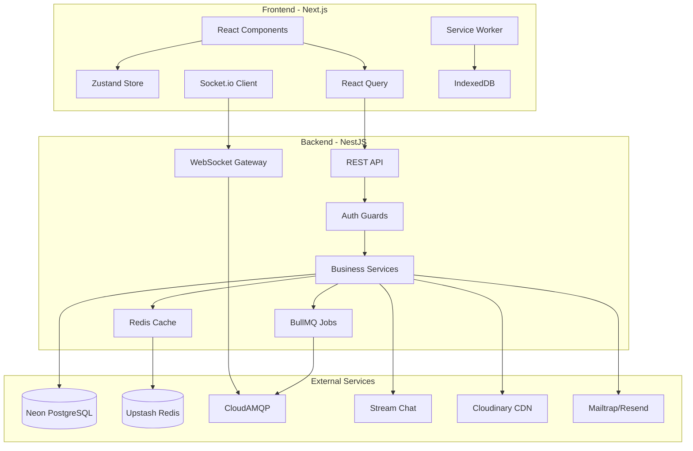

# CareCircle Technology Stack Documentation

> A comprehensive overview of all technologies, frameworks, libraries, and services used in the CareCircle platform.

---

## Table of Contents

- [Backend (NestJS API)](#backend-nestjs-api)
- [Frontend (Next.js Web App)](#frontend-nextjs-web-app)
- [Architecture Patterns & Techniques](#architecture-patterns--techniques)
- [DevOps & Infrastructure](#devops--infrastructure)
- [Summary](#summary)

---

## Backend (NestJS API)

### Core Framework

| Technology | Purpose |
|------------|---------|
| **NestJS 10.x** | Main backend framework (Node.js) |
| **TypeScript** | Type-safe JavaScript |
| **Express** | HTTP server (NestJS platform adapter) |

### Database & ORM

| Technology | Purpose |
|------------|---------|
| **PostgreSQL** | Primary relational database |
| **Prisma ORM** | Database ORM with type-safe queries |
| **Neon DB** | Serverless PostgreSQL hosting with PITR backups |

### Caching & Session

| Technology | Purpose |
|------------|---------|
| **Redis (Upstash)** | In-memory caching, session storage, OTP storage |
| **Custom CacheService** | Pattern-based cache invalidation, TTL management |

### Authentication & Security

| Technology | Purpose |
|------------|---------|
| **JWT (jsonwebtoken)** | Access & refresh token authentication |
| **Passport.js** | Authentication middleware |
| **bcrypt** | Password hashing |
| **httpOnly Cookies** | Secure refresh token storage |
| **Rate Limiting (@nestjs/throttler)** | Brute-force protection |
| **CORS** | Cross-origin resource sharing |
| **Helmet** | Security headers |

### Real-time Communication

| Technology | Purpose |
|------------|---------|
| **Socket.io** | WebSocket server for real-time events |
| **@nestjs/websockets** | WebSocket gateway integration |
| **Stream Chat** | Third-party chat service (family messaging) |

### Message Queues & Background Jobs

| Technology | Purpose |
|------------|---------|
| **BullMQ** | Job queue for background processing |
| **RabbitMQ (CloudAMQP)** | Event-driven architecture, pub/sub messaging |
| **Dead Letter Queue** | Failed job handling with Slack alerts |

### Email & Notifications

| Technology | Purpose |
|------------|---------|
| **Nodemailer** | Email sending |
| **Mailtrap/Resend/Brevo** | Email service providers |
| **web-push** | Web Push notifications (VAPID) |

### File Storage

| Technology | Purpose |
|------------|---------|
| **Cloudinary** | Document and image storage |
| **Multer** | File upload handling |

### API Documentation

| Technology | Purpose |
|------------|---------|
| **Swagger/OpenAPI (@nestjs/swagger)** | Auto-generated API docs |
| **class-validator** | DTO validation |
| **class-transformer** | Object transformation |

### Monitoring & Logging

| Technology | Purpose |
|------------|---------|
| **Prometheus** | Metrics collection |
| **Sentry** | Error tracking |
| **Custom Logger** | Structured logging |
| **Health Checks** | `/health`, `/ready`, `/live` endpoints |

### Testing

| Technology | Purpose |
|------------|---------|
| **Jest** | Unit and E2E testing |
| **K6** | Load/performance testing |
| **Supertest** | HTTP assertions |

---

## Frontend (Next.js Web App)

### Core Framework

| Technology | Purpose |
|------------|---------|
| **Next.js 14.x** | React framework with App Router |
| **React 18** | UI library |
| **TypeScript** | Type-safe JavaScript |

### State Management

| Technology | Purpose |
|------------|---------|
| **Zustand** | Global state (auth, user data) |
| **React Query (TanStack Query)** | Server state, caching, mutations |
| **React Context** | Family space selection context |
| **localStorage** | Persistence for selections |

### Styling & UI

| Technology | Purpose |
|------------|---------|
| **Tailwind CSS** | Utility-first CSS |
| **Framer Motion** | Animations and transitions |
| **Radix UI** | Accessible UI primitives (Dropdown, Dialog) |
| **Lucide React** | Icon library |
| **class-variance-authority** | Component variants |
| **clsx/tailwind-merge** | Class name utilities |

### Real-time Features

| Technology | Purpose |
|------------|---------|
| **Socket.io Client** | WebSocket connection |
| **stream-chat-react** | Stream Chat UI components |
| **Web Push API** | Browser push notifications |
| **Service Workers** | Offline support, push handling |

### Offline Support

| Technology | Purpose |
|------------|---------|
| **IndexedDB (idb)** | Offline data storage |
| **Service Worker** | Background sync, caching |
| **Offline Queue** | Pending actions sync when online |
| **Online/Offline Detection** | Navigator.onLine API |

### Forms & Validation

| Technology | Purpose |
|------------|---------|
| **React Hook Form** | Form state management |
| **Zod** | Schema validation |
| **Custom Input components** | Styled form inputs |

### Notifications & Feedback

| Technology | Purpose |
|------------|---------|
| **react-hot-toast** | Toast notifications |
| **Custom NotificationBell** | In-app notification center |
| **Notification Permission Popup** | Web Push permission request |

### Performance Optimization

| Technology | Purpose |
|------------|---------|
| **next/font** | Self-hosted fonts (Libre Baskerville, Source Sans 3) |
| **next/image** | Optimized image loading |
| **Dynamic imports** | Code splitting, lazy loading |
| **@next/bundle-analyzer** | Bundle analysis |
| **@vercel/analytics** | Performance monitoring |
| **@vercel/speed-insights** | Core Web Vitals |

### Authentication

| Technology | Purpose |
|------------|---------|
| **httpOnly Cookie refresh** | Secure token refresh |
| **JWT in memory** | Access token storage |
| **Protected Routes** | Auth guards |

### Internationalization

| Technology | Purpose |
|------------|---------|
| **Custom i18n** | English and French support |

---

## Architecture Patterns & Techniques

### System Architecture Diagram

### Backend Patterns

| Pattern | Description |
|---------|-------------|
| **Modular Architecture** | Feature-based modules (auth, family, medications, etc.) |
| **Repository Pattern** | Prisma-based data access |
| **DTO Pattern** | Request/response validation |
| **Guard Pattern** | Authentication and authorization |
| **Decorator Pattern** | Custom decorators (@GetUser, @Public) |
| **Event-Driven** | RabbitMQ consumers for async processing |
| **CQRS-lite** | Separate read/write paths with caching |
| **Cache-Aside** | Redis caching with pattern invalidation |

### Frontend Patterns

| Pattern | Description |
|---------|-------------|
| **Server Components** | Next.js App Router |
| **Client Components** | Interactive UI with 'use client' |
| **Context + Zustand** | Hybrid state management |
| **Optimistic Updates** | React Query mutations |
| **Offline-First** | IndexedDB queue with sync |
| **Protected Routes** | HOC pattern for auth |
| **Compound Components** | Radix UI primitives |

### Real-time Architecture

| Feature | Implementation |
|---------|----------------|
| **WebSocket Events** | Family room broadcasts |
| **Push Notifications** | VAPID-based web push |
| **Event Sourcing** | RabbitMQ event routing |
| **Presence** | Online status tracking |

### Security Techniques

| Technique | Purpose |
|-----------|---------|
| **JWT + Refresh Token** | Dual token auth |
| **httpOnly Cookies** | XSS protection |
| **Rate Limiting** | Per-endpoint throttling |
| **RBAC** | Role-based access (ADMIN, CAREGIVER, VIEWER) |
| **Audit Logging** | HIPAA compliance |
| **Input Validation** | DTO + Zod validation |
| **CORS** | Whitelisted origins |

---

## DevOps & Infrastructure

| Technology | Purpose |
|------------|---------|
| **pnpm** | Monorepo package manager |
| **Turborepo** | Monorepo build orchestration |
| **Docker** | Containerization |
| **GitHub Actions** | CI/CD pipeline |
| **Kubernetes (k8s)** | Container orchestration configs |
| **Nginx** | Reverse proxy, load balancing |
| **dotenv** | Environment configuration |

---

## Summary

### Technology Counts

| Category | Count |
|----------|-------|
| Backend Core Technologies | 8 |
| Backend Libraries | 25+ |
| Frontend Core Technologies | 5 |
| Frontend Libraries | 20+ |
| External Services | 7 |
| Architecture Patterns | 15+ |

### External Services Overview

| Service | Type | Usage |
|---------|------|-------|
| **Neon DB** | Database | Serverless PostgreSQL with automatic backups |
| **Upstash Redis** | Cache | Session storage, caching, rate limiting |
| **CloudAMQP** | Message Queue | Event-driven communication |
| **Stream Chat** | Communication | Family messaging feature |
| **Cloudinary** | Storage | Document and image CDN |
| **Mailtrap/Resend/Brevo** | Email | Transactional email delivery |
| **Sentry** | Monitoring | Error tracking and performance |

---

## Version Information

- **Node.js**: 18.x LTS
- **NestJS**: 10.x
- **Next.js**: 14.x
- **React**: 18.x
- **TypeScript**: 5.x
- **Prisma**: 5.x

---

*Last Updated: January 2026*
